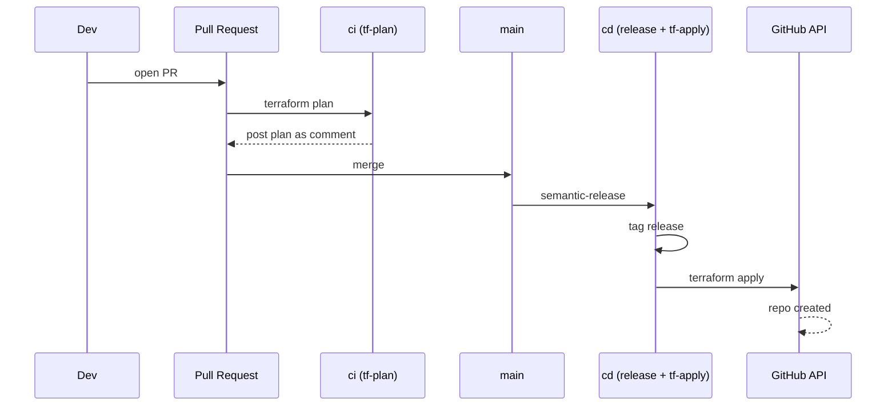

# github-ops

GitHub org/repo config as Terraform, via the [`integrations/github`](https://registry.terraform.io/providers/integrations/github/latest/docs) provider.

## What it manages

Each repo is declared as an instance of the `./modules/github-repo` module (`repos.tf`), covering:

- repo metadata (description, visibility, topics)
- branch/tag rulesets
- collaborators
- secrets
- webhooks
- GitHub App credential distribution

## Adding a repo

Add a `module` block in `repos.tf` calling `./modules/github-repo`:

```hcl
module "my_new_repo" {
  source = "./modules/github-repo"
  providers = {
    github = github
  }

  name        = "my-new-repo"
  description = "What it's for"
  visibility  = "public"
  topics      = ["terraform"]

  rulesets = [
    {
      name        = "Default branch"
      target      = "branch"
      enforcement = "active"
      conditions = {
        ref_name = {
          include = ["~DEFAULT_BRANCH"]
          exclude = []
        }
      }
      rules = {
        deletion         = true
        non_fast_forward = true
      }
    }
  ]
}
```

Then open a PR — `ci` (`.github/workflows/ci.yml`) plans the change and posts it as a PR comment. Merging to `main` runs `cd` (`.github/workflows/cd.yml`), which release-tags the commit; the tag push then applies the plan and creates the repo.



## Apps

Registered GitHub Apps live in `apps.tf` (App ID, Client ID; private key via `octo_buddy_private_key`). A repo picks up an app via `apps = { octo_buddy = local.octo_buddy }` on its `./modules/github-repo` call, which distributes its client ID/private key as an Actions variable/secret and can be referenced in a ruleset's `bypass_actors`. Which repos an App can access is managed by hand in the App's own installation settings — Terraform can't reliably manage this (the provider's app-installation-repository resource calls an endpoint that rejects classic PATs).

Currently registered: [Octo Buddy](https://github.com/apps/octo-buddy), used to mint short-lived tokens for releases in place of a stored PAT.

## Backend

State is stored in Terraform Cloud (`backend.tf`). Provider auth is via `github_token` / `github_owner` variables.
